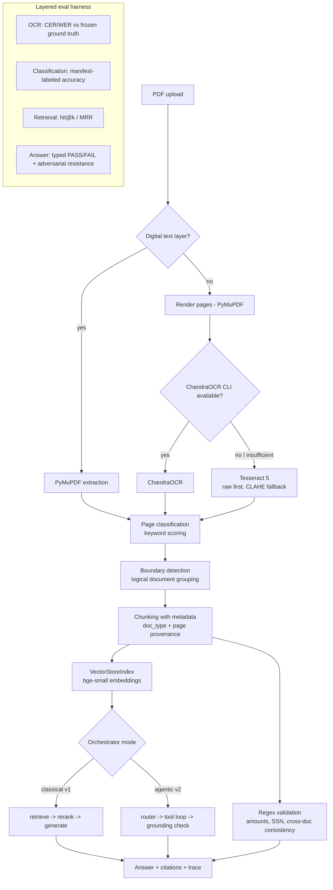

# Architecture

```mermaid
flowchart TD
    A[PDF upload] --> B{Digital text layer?}
    B -- yes --> C[PyMuPDF extraction]
    B -- no --> D[Render pages - PyMuPDF]
    D --> E{ChandraOCR CLI available?}
    E -- yes --> F[ChandraOCR]
    E -- no / insufficient --> G[Tesseract 5<br/>raw first, CLAHE fallback]
    C --> H[Page classification<br/>keyword scoring]
    F --> H
    G --> H
    H --> I[Boundary detection<br/>logical document grouping]
    I --> J[Chunking with metadata<br/>doc_type + page provenance]
    J --> K[Regex validation<br/>amounts, SSN, cross-doc consistency]
    J --> L[VectorStoreIndex<br/>bge-small embeddings]
    L --> M{Orchestrator mode}
    M -- classical v1 --> N[retrieve -> rerank -> generate]
    M -- agentic v2 --> O[router -> tool loop -> grounding check]
    N --> P[Answer + citations + trace]
    O --> P
    K --> P

    subgraph Evals [Layered eval harness]
        Q[OCR: CER/WER vs frozen ground truth]
        R[Classification: manifest-labeled accuracy]
        S[Retrieval: hit@k / MRR]
        T[Answer: typed PASS/FAIL + adversarial resistance]
    end
```

Every stage has its own eval layer so a regression is attributable to one stage,
not smeared across an end-to-end score. See `docs/design.md` for the decision log.
